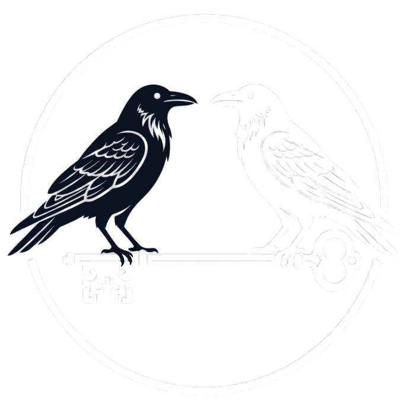

# Descubre con Lúa · Edición Vigo

Aplicación Android educativa, **sin conexión**, para las escuelas infantiles
municipales de Vigo, los colegios de la ciudad y sus familias. Cubre las dos
etapas de educación infantil: **primer ciclo (0-3 años)** y **segundo ciclo
(3-6 años)**. Todo el contenido existe en gallego y castellano.

- **Juega con Lúa · Aula** — la usa la docente en la asamblea. Incluye
  **Formación · Aula**: una cápsula de tres minutos por cada paso de la asamblea.
- **Asamblea matinal de segundo ciclo** — para 4.º, 5.º y 6.º de Infantil, con
  el inglés como tercera lengua. Cuatro fases —apertura, foco rítmico, reto TPR
  y calma—, cada una con su consigna, su lámina, su cronómetro y su altavoz; el
  nivel se cambia sin salir de la pantalla. Es **la misma pantalla que la
  asamblea de primer ciclo**: el producto tiene un solo lenguaje visual. Se
  entra por la lista del aula o por la ficha del mes del Calendario.
- **Academy · Familias** — la usan las familias en casa. Incluye la
  **micro-rutina del mes** para segundo ciclo: tres minutos en un momento
  concreto del día, con ejemplos de cómo devolver la frase bien dicha sin pedir
  que la criatura la repita.
- **Calendario Escola · Fogar** — los diez meses del curso, de septiembre a
  junio. La docente registra la asamblea, la familia registra el juego de tres
  minutos en casa, y el día que coinciden las dos cosas queda enlazado.
- **Los premios de Lúa** — nivel, XP, racha, insignias y las medallas del
  calendario. Premian **a la persona adulta** que usa la app, nunca a la
  criatura.

**El inglés no es una lengua de esta app: es contenido que se escucha.** Ninguna
pantalla se lee en inglés. Lo que hay son las palabras, las órdenes de cuerpo
(TPR) y la frase de cada mes, cada una con su grabación: la persona adulta pulsa
y oye cómo se dice antes de decírselo a la criatura. Una maestra de una escuela
infantil de Vigo no tiene por qué pronunciar «Crunch leaves» de oído.

En segundo ciclo el inglés entra como **tercera lengua dentro de la asamblea**,
siempre asociado al movimiento y sin pedir que nadie lo produzca: la orden se
dice y se hace, y la criatura responde con el cuerpo. El gallego y el castellano
siguen siendo las lenguas del aula y de la casa.

**Finalidad exclusivamente educativa.** No es un producto sanitario: no evalúa,
no diagnostica y no trata nada. La criatura no usa la pantalla; la app es para
la persona adulta que acompaña.

<p align="center">
  
  &nbsp;&nbsp;&nbsp;
  
  &nbsp;&nbsp;&nbsp;
  
</p>

<p align="center">
  <sub><strong>Dr. Frank Alberto Betances Reinoso</strong> · Incubadora de Alta
  Tecnoloxía <strong>startTIC</strong> · <strong>Consorcio da Zona Franca de
  Vigo</strong></sub>
</p>

El proyecto **nace dentro del programa startTIC**, que es parte del **Consorcio
da Zona Franca de Vigo**. Las marcas de la cabecera y de los créditos están por
procedencia —de dónde sale esto—, no como respaldo pedido a un tercero.

**Licencia: gratis para las familias, con licencia para las instituciones.**
Para una familia o una persona a título individual, gratis y para siempre. Para
una escuela, un ayuntamiento, un gabinete o una empresa, hace falta una licencia
por escrito. El texto completo está en [LICENSE.md](LICENSE.md).

## Documentación

| | |
| --- | --- |
| [**Manual de casos de uso**](docs/manual-casos-de-uso.html) | Para la docente y la familia: seis capítulos —qué es y qué no es, antes de empezar, el mapa de la app, cómo funciona una asamblea, los límites de esta versión y qué hacer si algo va mal— más 17 casos de uso, incluidos los dos de segundo ciclo: conducir la asamblea matinal y hacer la micro-rutina en casa. Lleva 24 imágenes de pantalla, cada una en gallego y en castellano. **No lleva documentación de desarrollo**: eso vive aquí y en `PROJECT.md`. También en [PDF](docs/Descubre-con-Lua-Manual-Casos-de-Uso.pdf) y [Word](docs/Descubre-con-Lua-Manual-Casos-de-Uso.docx) |
| [**STATUS.md**](STATUS.md) | Qué funciona y qué no, con la evidencia al lado de cada línea |
| [**PROJECT.md**](PROJECT.md) | Arquitectura y diseño |
| [**CLAUDE.md**](CLAUDE.md) | Reglas de trabajo del proyecto |
| [**LICENSE.md**](LICENSE.md) | Quién puede usar esto y con qué condiciones |

Si sólo vas a leer uno: **STATUS.md**, que separa lo comprobado de lo no
comprobado y nombra el comando que lo comprobó.

## Qué hay dentro

| | |
| --- | --- |
| Contenido · primer ciclo | 10 unidades de aula, una por mes del curso · 10 meses de calendario · 6 fases de asamblea |
| Contenido · segundo ciclo | 3 asambleas matinales, una por nivel (4.º, 5.º y 6.º de Infantil), de 4 fases cada una |
| Cápsulas | 12: 6 de Academy para las familias y 6 de formación docente |
| Voz | 1135 locuciones (494 gl + 494 es + 147 en) grabadas dentro del paquete |
| Láminas | 80 propias, dibujadas como datos: 50 de vocabulario y 30 escenas del cuento |
| Premios | 6 niveles, 9 insignias y 6 medallas de calendario, todos de la persona adulta |
| Android | `minSdk 24` · `compileSdk` y `targetSdk` 36 |

El binario **no declara ni un permiso de red**, y eso lo comprueba un gate que
lee el APK compilado, no el manifiesto fuente.

**El estado de verificación no vive en este documento.** Qué está comprobado,
con qué comando, y qué no lo está, va en [STATUS.md](STATUS.md), que es el
fichero cuya regla es que cada línea diga con qué se comprobó. Aquí no se
resume: un resumen de estado envejece en silencio y acaba afirmando de más.

## Comprobar

```bash
flutter pub get
tools/gates.sh --fast   # formato, análisis, tests y gates de contenido
tools/gates.sh          # además compila el APK release y audita sus permisos
```

CI ejecuta ese mismo script (`.github/workflows/ci.yml`). La lista de gates vive
en el script, no en un documento que se pueda quedar atrás. Esta tabla es una
copia de cortesía, en el orden en que corren; si discrepa de `tools/gates.sh`,
manda el script:

| Gate | Qué comprueba |
| --- | --- |
| `dart format` · `flutter analyze` · `flutter test` | Formato, análisis y la suite, ejecutándose de verdad |
| `check_contact_email.py` | Que no aparezca ningún correo distinto del fijo del proyecto |
| `check_bundled_assets.py` | Que todo activo que el código pide exista y viaje dentro del paquete |
| `check_laminas.py` | Que cada forma de cada lámina se pinte de verdad, y no salga una lámina en blanco |
| `check_no_emoji.py` | Que no se use emoji del sistema como iconografía (regla 5) |
| `export_voice_corpus.py --check` | Que el corpus de voz siga sincronizado con los textos |
| `check_pulse_bpm.py` | Que el tempo mostrado sea el que suena, **medido del audio** |
| `check_pulse_markers.py` | Que el compás sea constante e igual en las dos lenguas |
| `check_voice_coverage.py` | Que toda locución reproducible tenga grabación en el paquete |
| `check_voice_levels.py` | Que ninguna grabación del paquete pique cerca de saturación, **medido del fichero** |
| `check_manual_build.py` | Que el PDF y el Word del manual salgan del HTML actual y no de uno anterior |
| `check_legal_urls.py --offline` | Que las páginas legales de `docs/` existan, sean lo que dicen ser y lleven el correo fijo |
| `flutter build apk --release` | Que el APK compile |
| Permisos del APK | Que el **binario** no declare más permiso que el que inyecta AndroidX |

Los dos últimos solo corren sin `--fast`: son los que necesitan el SDK de
Android. Por eso `--fast` da **14 de 14** y el run completo, **16 de 16**.

## Publicar

El mismo workflow que corre los gates compila el binario firmado. No hay un
segundo workflow que recompile lo mismo con otra configuración.

| Artefacto | Cuándo se produce | Retención |
| --- | --- | --- |
| `android-apk` (`.apk`) | En `main` y en «Run workflow» | 5 días |
| `android-apk-<run>` (`.apk`) | En cualquier rama | 2 días |
| `android-aab` (`.aab`) | En `main` y en «Run workflow», **solo con secrets de firma** | 3 días |
| `android-mapping` (`mapping.txt`) | Cuando exista (hoy `minifyEnabled false`) | 30 días |

Las ramas también compilan y suben su propio APK, con nombre y retención
propios para no pisar el de `main`.

Al final de cada run se retiran los artefactos viejos y se dejan 2 copias de
cada nombre (10 del mapa de R8), para que el almacenamiento tenga un suelo fijo
en vez de crecer con el ritmo de commits.

### Claves de firma

Los nombres de los secrets de firma están en `.github/workflows/ci.yml`, que es
donde se usan. **Su estado —si están dados de alta, con qué clave y desde
cuándo— no se documenta aquí**: este repositorio es público y eso es
información de operación.

Si faltasen, el APK se firmaría con la **clave de depuración** —se instala a
mano, y Google Play lo rechaza— y el AAB no se generaría, porque un AAB sin
firmar no se puede subir a ningún sitio y solo sería un fichero que engaña.

Un gate en rojo también bloquea el AAB: los pasos posteriores a uno fallido se
saltan. Cuando el AAB no aparezca, el motivo está más arriba en el run.
El paso «Comprobar con qué clave va firmado» lee el certificado **del APK** con
`apksigner` y lo publica en el resumen del run, igual que el gate de permisos lee
el binario en vez de la configuración.

`versionCode` sale del número de run del workflow, porque Play exige que cada
subida lleve uno mayor que el anterior; `pubspec.yaml` lo deja fijo en 1.


## El pulso se ve, no se oye

El metrónomo de la canción a pulso es **visual**. No es una decisión estética:
parte de las criaturas llevan audiófono o implante, y un metrónomo sonoro
compite justo con la voz que tienen que seguir.

Los tiempos del compás salen de las marcas `*` de la letra, no de una
configuración aparte, así que el pulso no puede discrepar de lo que la docente
lee.

## Dónde aparece Lúa

La gata es la marca, no un reclamo para la criatura: **aparece para la docente
y para la familia, nunca para captar la atención infantil**. Se pinta siempre
desde la misma rejilla de caracteres que rinde el icono del lanzador y el
splash (`assets/brand/lua_*.txt`), así que no puede separarse del icono.

Dentro de una actividad sale en tres sitios, y en ninguno más:

| Dónde | Qué hace |
| --- | --- |
| El cuento de la asamblea | Es la protagonista: las 30 láminas de escena la dibujan y el texto de las diez unidades la nombra |
| El cierre de cada cápsula de Academy | Una frase —`luaDice` en el JSON— que convierte la idea de la cápsula en **un** gesto para hoy. Va la última, detrás de la reflexión: la cápsula se cuenta como leída al responderla, así que el premio cae primero y la gata cierra |
| La nota para las casas | Encabeza la nota que cruza del aula al hogar, que es la única pantalla que habla de ella por su nombre |

Fuera de una actividad sale en la bienvenida, en los premios, en el calendario
y en los créditos.

Las cápsulas de formación del aula **todavía no traen cierre**: `luaDice` es
opcional y, sin él, el lector no pinta la página.

## Voz

El audio se genera con voces neuronales en tiempo de compilación y viaja
grabado dentro del paquete. Los modelos **nunca** corren en el aparato.

Casi todas las tarjetas con texto seguido llevan botón de altavoz: la lectura
del cuento, las preguntas, la exploración, las matemáticas, el puente con la
casa, y en Academy las cuatro partes de cada cápsula, sus afirmaciones y el
cierre de Lúa. Si un texto no tiene grabación, el botón **no se pinta** —ni
apagado ni con aviso—: un altavoz que no suena promete algo que no cumple.

- gallego → **Celtia**, do Proxecto Nós (*gated* en Hugging Face: requiere el
  secret `HF_TOKEN`)
- castellano → **Sharvard** (rhasspy/piper-voices)
- inglés → **LJSpeech** (rhasspy/piper-voices)

**El inglés es un caso aparte.** No hay pantallas en inglés: lo que se graba es
el léxico, las órdenes TPR y la frase de cada mes del calendario, que salen de
`assets/content/calendario/meses.json`. La persona adulta pulsa la pastilla y
oye cómo se dice antes de decírselo a la criatura. Una pastilla sin grabación se
pinta igual, con la palabra legible y sin altavoz.

```bash
python3 tools/export_voice_corpus.py       # corpus desde assets/content
python3 tools/generate_voice_assets.py --lang gl
python3 tools/check_voice_coverage.py      # ¿falta alguna grabación?
```

El identificador de cada grabación es el hash de su propio texto, así que
editar una frase cambia el identificador, la grabación pasa a faltar y el gate
lo detecta. La app no puede enseñar un texto y reproducir otro.

## Privacidad

Cero datos personales, cero analítica, cero SDK de terceros, y ningún permiso
de red. `pubspec.yaml` no tiene una sola dependencia externa: la reproducción de
audio va por un `MethodChannel` contra el `MediaPlayer` de Android.

**Lo único que la app guarda**, en el almacenamiento privado del aparato: los
contadores de los premios **de la persona adulta** —asambleas dirigidas,
cápsulas leídas, racha actual y mejor racha, la fecha del último día *sin hora*
e identificadores de insignias—. No identifica a nadie, no contiene nada de
ninguna criatura y no puede salir del aparato. Lo guarda un gate:
`test/features/premios_test.dart` falla si aparece una clave nueva en ese
fichero.

La comprobación que cuenta se hace sobre el **APK compilado** con `aapt2`, no
sobre el manifiesto fuente.

**URLs legales** (las que se declaran en Play Console; salen del sitio de Pages
que publica `docs/`):

| | |
| --- | --- |
| Política de privacidad | `https://frankbetances.github.io/Descubre-con-lua/privacy.html` |
| Página del proyecto | `https://frankbetances.github.io/Descubre-con-lua/` |

Las vigilan dos gates: `check_legal_urls.py --offline` dentro de `tools/gates.sh`
comprueba los ficheros, y `.github/workflows/legal-urls.yml` pide las URLs **a
diario**. El segundo existe porque un sitio de Pages se puede apagar sin que se
ponga rojo nada, y entonces la ficha de la tienda apunta a un 404 con el último
despliegue en verde. Un despliegue correcto no demuestra que el sitio esté
vivo; solo lo demuestra pedir la URL.

Contacto: frank.alberto.betances.reinoso@gmail.com

## El manual

`docs/manual-casos-de-uso.html` es la **fuente única**. De ahí salen el PDF y el
Word; no se editan a mano:

```bash
npm install playwright                          # sólo para el PDF
CHROMIUM_PATH=<chrome> node docs/build-pdf.js   # → docs/*.pdf
pip install python-docx lxml                    # sólo para el Word
python3 docs/build-docx.py                      # → docs/*.docx
python3 tools/check_manual_build.py             # ¿alguno se quedó atrás?
```

El texto vive en un solo sitio a propósito: cuando el constructor lleva su
propia copia, la fuente avanza y el documento generado se queda describiendo una
versión anterior sin que nada avise.

Las 24 imágenes que el manual incrusta viven en `docs/capturas/` —que guarda 36
PNG en total, porque también están las de las láminas y las que aún no entran en
el manual— y se regeneran con:

```bash
flutter test --tags capturas --update-goldens test/capturas_test.dart
```

**No son fotos de un móvil.** Son el árbol de widgets real pintado por el motor
de Flutter, con la tipografía y el contenido de la app, pero sin muesca, sin
barra de gestos, sin la densidad de un aparato concreto y sin audio. Ver
[`docs/capturas/README.md`](docs/capturas/README.md). Sustituirlas por capturas
de verdad es reemplazar los PNG; el manual no se toca.

## Licencia

**Gratis para las familias. Con licencia para las instituciones.**

| Quién | Qué puede hacer |
| --- | --- |
| Una familia, una persona a título individual | Usar la app, leer y compilar el código, modificarlo para su casa. **Gratis, para siempre, sin pedir permiso** |
| Una escuela, un ayuntamiento, un hospital, una asociación, una universidad | **Licencia previa por escrito**, aunque el uso sea gratuito y la entidad no tenga ánimo de lucro |
| Cualquiera que cobre por usarla o por servicios prestados con ella | **Licencia previa por escrito** |

Nadie —ni siquiera en uso personal— puede redistribuirla, publicarla en una
tienda, quitarle los créditos ni presentarla como propia.

Las condiciones de una licencia institucional se acuerdan caso por caso y
**pueden ser gratuitas** (convenios con administraciones, pilotos). Se piden en
frank.alberto.betances.reinoso@gmail.com.

Los componentes de terceros conservan su licencia: la tipografía Nunito (SIL
OFL 1.1, en `assets/fonts/OFL.txt`), Flutter y sus paquetes, y los modelos de
voz Celtia, Sharvard y LJSpeech, que **solo corren en compilación y nunca en el
aparato**. Los logotipos institucionales son marcas de sus titulares y no se
licencian aquí.

El texto que manda es [LICENSE.md](LICENSE.md).

## Estructura

```
lib/core/       tema, idiomas, audio (servicio, reproductor nativo, ids de voz)
lib/data/       modelos, cargador, repositorio, validador de contenido
lib/features/   juega/ (aula, asamblea de 6 fases, metrónomo, formación docente)
                academy/ (familias) · calendario/ (escola·fogar, 10 meses)
                premios/ (insignias y medallas) · bienvenida/ · creditos/
assets/content/ unidades, cápsulas, asamblea y premios en JSON, bilingües
                calendario/ (10 meses + guía de inglés en casa)
assets/voice/   grabaciones neuronales (generadas en CI)
assets/brand/   rejilla de píxeles de Lúa: de aquí salen icono y splash
                awards/ (los 10 glifos de insignia) · logos/ (marcas)
docs/capturas/  32 PNG del motor de Flutter; 20 los incrusta el manual
tools/          gates y tubería de voz
LICENSE.md      condiciones de uso: familias gratis, instituciones con licencia
```
